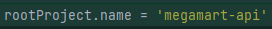
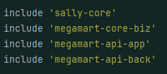
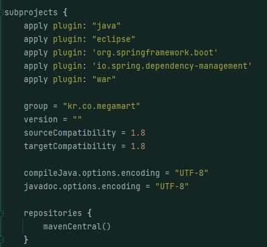

# Index

- gradle 구성 요소
- gradle vs maven
- Gradle의 Multi Module이란

## gradle 구성 요소

### Plugin

* gradle task의 집합
  
  * 코드를 컴파일하고, 컴파일된 바이트 코드의 묶음을 패키징하거나, DB와 통신하는 부분들에 문제가 없는지, 서버와 통신하는 부분들에 문제가 없는지에 대한 테스트도 돌려야하는데 이는 모두 gradle 파일에서 task 단위로 이루어진다. 
  
  * 따라서 우리는 이를 효율적으로 처리하기 위해 묶음처리 해놓는데, 이를 플러그인이라 한다.
  
  * 플러그인 적용의 종류
    * 핵심 플러그인 적용
      * ex) id 'java'
    * gradle 플러그인 포털에서 커뮤니티 플러그인을 적용 
      * ex) id 'org.springframework.boot' version '2.4.6'
      * (https://plugins.gradle.org/)

### Group

* 프로젝트나 동작중인 태스크의 그룹 ID
  
  

### Configuration

* gradle 작업을 하기 위해 필요한 gradle task를 순차적으로 수행, 보통 라이브러리로 가져오는 작업이나, 프로젝트를 configure하는 작업들이 이 단계에서 수행된다.

### Repository

* 어떤 저장소를 사용하는지를 빌드 파일에 작성하여 설정할 수 있다.
* maven central은 maven 중앙 저장소이다. 

### Dependencies

* 저장소에 필요한 라이브러리를 사용하는데 필요

## gradle vs maven

### Maven
* XML 기반으로 작성한다.
* pom.xml에 필요한 라이브러리를 선언하면 자동으로 해당 프로젝트로 불러와 편리하다.
* 빌드 순서는 compile > test > package (jar, war 형태로 압축) 순서.

### Gradle
* Ant의 유연한 구조적 장점과 Maven의 편리한 의존성 관리 기능을 합쳐놓은 것
* 멀티 프로젝트에 사용하기 좋음
* Build라는 동적인 요소를 XML로 정의하기에는 어려운 부분이 많다.
* 상속구조를 이용한 멀티 모듈 구현
* 설정 주입 시 프로젝트의 조건을 체크할 수 있어서 프로젝트별로 주입되는 설정을 다르게 할 수 있다.
* Gradle은 메이븐 보다 빌드 속도가 최대 100배 빠르다. 또한 Gradle이 캐시를 사용하기 때문에 테스트 반복 시 차이가 더 커진다.

## Gradle의 Multi Module이란

* Gradle의 Multi Module이란 프로젝트 구성시  web, app, api 등 용도가 서로 다른 프로젝트를 생성하는 경우를 말한다. 
프로젝트가 다르더라도 바라보는 DataBase 가 같다면 기본적인 기능은 상당수가 공통적으로 겹치게 된다. 
유지 보수 차원에서 공통적인 부분이 존재 한다면 같은 작업을 여러번 해야한다는 의미 이다. 이러한 문제를 해결하고 빌드를 효율적으로 하기 위해 Gradle의 Multi Module 을 활용할수 있다.

* 아래는 멀티 모듈의 settings.gradle 예시이다. 
  * settings.gradle 파일에 아래와 같이 최상위 프로젝트 이름(coffee)을 지정한다. 
  이는 해당 프로젝트 디렉토리 이름과 무관하게 설정할수 있다.
  
  
  * 하위 프로젝트를 include해준다.
   *  
  * 최상위 프로젝트의 build.gradle에 모든 서브 프로젝트에 공통된 설정을 넣는다.
  * 

## 기타 참고자료
* [StackOverflow gradle 버전 차이에 따른 오류](https://stackoverflow.com/questions/23796404/could-not-find-method-compile-for-arguments-gradle)
